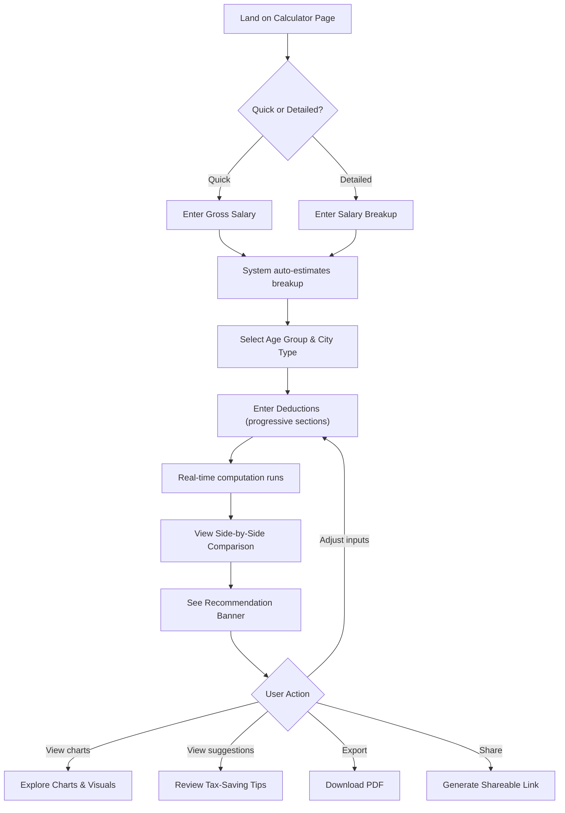

# Product Requirements Document: Indian Income Tax Calculator

**Product**: Indian Income Tax Calculator — Old vs. New Regime Comparison Tool
**Financial Year**: FY 2025-26 (Assessment Year 2026-27)
**Version**: 1.0
**Date**: June 11, 2026
**Status**: Draft — Awaiting Review

---

## 1. Overview & Objective

### 1.1 Problem Statement

Every year, millions of salaried individuals in India face the question: *"Should I choose the Old Tax Regime or the New Tax Regime?"* The answer depends on a complex interplay of salary structure, deductions, exemptions, and current-year slab rates. Most people either overpay tax due to poor regime selection or spend significant time (and money) consulting professionals for what should be a straightforward comparison.

### 1.2 Product Vision

Build a **free, no-login, web-based Indian Income Tax Calculator** that empowers any salaried individual to:

1. Enter their salary details (from a simple gross number to a full CTC breakup).
2. Input applicable deductions and exemptions.
3. Instantly see a **side-by-side comparison** of total tax payable under the Old Regime vs. the New Regime.
4. Receive a clear **recommendation** on which regime saves more money — and by how much.
5. Get **personalized, actionable tax-saving suggestions** based on unused deduction headroom.
6. **Export** a professional PDF report or **share** a pre-filled link with a CA or family member.

### 1.3 Design Principles

| Principle | Description |
|:---|:---|
| **Simplicity first** | A user with no tax knowledge should complete a basic calculation in under 2 minutes. |
| **Progressive disclosure** | Start simple (gross salary), reveal complexity on demand (full breakup + all deductions). |
| **Accuracy** | All computations strictly follow the Income Tax Act provisions for FY 2025-26. |
| **Transparency** | Every number is explained — slab-wise breakdowns, formula tooltips, and help text. |
| **Zero friction** | No login, no signup, no ads blocking the UI, no paywalls. |

---

## 2. Target Users & Personas

### Persona 1 — Riya, the First-Job Employee

| Attribute | Detail |
|:---|:---|
| **Age** | 23 |
| **Role** | Junior Software Engineer, Bangalore |
| **Salary** | ₹8,00,000 CTC |
| **Tax Literacy** | Low — has never filed taxes independently |
| **Goal** | Understand basic tax liability, figure out if she should "opt out" of the New Regime |
| **Pain Point** | Overwhelmed by jargon (80C, HRA, surcharge); wants a tool that *explains as it calculates* |

### Persona 2 — Amit, the Mid-Career Professional

| Attribute | Detail |
|:---|:---|
| **Age** | 35 |
| **Role** | Product Manager, Mumbai |
| **Salary** | ₹25,00,000 CTC |
| **Tax Literacy** | Moderate — knows about 80C, 80D, home loan deductions |
| **Goal** | Maximize deductions under the Old Regime and confirm whether it beats the New Regime |
| **Pain Point** | Spends hours in Excel every year building a comparison; wants an instant, reliable tool |

### Persona 3 — Sunita, the Senior Employee Near Retirement

| Attribute | Detail |
|:---|:---|
| **Age** | 58 |
| **Role** | General Manager, Delhi |
| **Salary** | ₹55,00,000 CTC |
| **Tax Literacy** | High — has a CA but wants to independently verify |
| **Goal** | Cross-check surcharge impact, NPS employer contribution benefits, and net take-home |
| **Pain Point** | Existing calculators don't handle surcharge marginal relief correctly or miss 80CCD(2) |

### Persona 4 — Vikram, the Chartered Accountant

| Attribute | Detail |
|:---|:---|
| **Age** | 40 |
| **Role** | Practicing CA |
| **Tax Literacy** | Expert |
| **Goal** | Quickly run regime comparisons for multiple clients and share clean reports |
| **Pain Point** | Needs shareable links and PDF exports; wants slab-level detail he can show clients |

---

## 3. User Stories

### Input & Calculation

| ID | Story | Priority |
|:---|:---|:---:|
| US-01 | As a **salaried individual**, I want to enter just my gross annual salary so I can get a quick tax estimate without knowing my full CTC breakup. | P0 |
| US-02 | As a **tax-aware user**, I want to enter a detailed salary breakup (Basic, DA, HRA, Special Allowance, LTA, Bonus, EPF, Professional Tax, Gratuity, custom items) so I get a precise calculation. | P0 |
| US-03 | As a user of the **Old Regime**, I want to enter my deductions under Sections 80C, 80CCC, 80CCD, 80D, 80E, 80EEA, 80G, 80TTA/80TTB, and 24(b) so my taxable income is accurately reduced. | P0 |
| US-04 | As a user, I want the tool to **auto-calculate my HRA exemption** based on my Basic Salary, HRA received, actual rent paid, and metro/non-metro city selection. | P0 |
| US-05 | As a user, I want to see my tax computed under **both** regimes simultaneously so I can compare them side by side. | P0 |
| US-06 | As a user, I want to see a **slab-wise breakdown** of how my tax is computed (how much income falls in each slab and the corresponding tax) for each regime. | P0 |
| US-07 | As a user, I want **surcharge and cess** to be automatically applied based on my income level. | P0 |
| US-08 | As a user, I want to see my **effective tax rate** and **marginal tax rate** for both regimes. | P1 |
| US-09 | As a user, I want to see an estimated **monthly and annual net take-home salary** after tax, PF, and professional tax deductions. | P1 |

### Comparison & Recommendation

| ID | Story | Priority |
|:---|:---|:---:|
| US-10 | As a user, I want a clear **recommendation banner** telling me which regime saves me more tax and by exactly how much (₹). | P0 |
| US-11 | As a user, I want to see a **bar chart** comparing Old vs. New Regime tax payable. | P1 |
| US-12 | As a user, I want to see a **pie/donut chart** showing the tax breakup (base tax, surcharge, cess). | P1 |
| US-13 | As a user, I want to see an **income allocation chart** showing how my salary is split between tax, deductions, and take-home pay. | P1 |

### Tax-Saving Suggestions

| ID | Story | Priority |
|:---|:---|:---:|
| US-14 | As a user of the Old Regime, I want **personalized suggestions** highlighting unused deduction headroom (e.g., "You have ₹30,000 unused in 80C — investing in ELSS could save ₹9,360"). | P1 |
| US-15 | As a user, I want suggestions to be context-aware — don't suggest 80D for parents if I've already claimed the full limit. | P1 |

### Export & Share

| ID | Story | Priority |
|:---|:---|:---:|
| US-16 | As a user, I want to **download a PDF report** of my full tax calculation, comparison, and recommendations. | P1 |
| US-17 | As a user, I want to **generate a shareable link** that pre-fills the calculator with my inputs, so I can share it with my CA or family member. | P2 |

### Help & Education

| ID | Story | Priority |
|:---|:---|:---:|
| US-18 | As a first-time user, I want **tooltips on every deduction field** explaining what it is and what qualifies, in plain English. | P0 |
| US-19 | As a user, I want contextual **input validation messages** (e.g., "80C total cannot exceed ₹1,50,000") that guide me instead of blocking me. | P0 |

---

## 4. Functional Requirements

### FR-1: Salary Structure Input

#### FR-1.1 Quick-Start Mode
- **FR-1.1.1**: The landing input should be a single field: **"Enter your Annual Gross Salary (₹)"**.
- **FR-1.1.2**: On entering a gross salary, the system shall use sensible default assumptions to estimate a salary breakup:
  - Basic Salary = 40% of Gross
  - HRA = 50% of Basic (if metro) or 40% of Basic (if non-metro)
  - Special Allowance = Remaining after Basic + HRA
  - Employee EPF = 12% of Basic (capped at ₹15,000/month Basic, i.e., max ₹21,600/year)
  - Employer EPF = 12% of Basic (same cap)
  - Professional Tax = ₹2,400/year (generic assumption)
- **FR-1.1.3**: The user shall be able to override any defaulted value.

#### FR-1.2 Detailed Breakup Mode
- **FR-1.2.1**: A toggle/expansion ("Show Detailed Breakup") shall reveal all salary component fields:

| # | Field | Type | Default | Validation |
|:---:|:---|:---:|:---:|:---|
| 1 | Basic Salary | Currency | — | ≥ 0 |
| 2 | Dearness Allowance (DA) | Currency | 0 | ≥ 0 |
| 3 | House Rent Allowance (HRA) | Currency | — | ≥ 0 |
| 4 | Special Allowance | Currency | — | ≥ 0 |
| 5 | Leave Travel Allowance (LTA) | Currency | 0 | ≥ 0 |
| 6 | Bonus / Performance Incentive | Currency | 0 | ≥ 0 |
| 7 | Employee EPF Contribution | Currency | — | ≥ 0 |
| 8 | Employer EPF Contribution | Currency | — | ≥ 0 |
| 9 | Professional Tax (Annual) | Currency | 2,400 | ≥ 0 |
| 10 | Gratuity (Annual) | Currency | 0 | ≥ 0 |
| 11 | Other Allowances (custom) | Currency | 0 | ≥ 0; multiple items via "Add Another" |

- **FR-1.2.2**: A **"Gross Salary"** read-only computed field shall sum all components and update in real time.
- **FR-1.2.3**: Custom allowance items shall allow the user to add a label (free text, max 50 chars) and an amount.

#### FR-1.3 User Profile Context
- **FR-1.3.1**: Age group selector: **Below 60 / 60–80 (Senior Citizen) / 80+ (Super Senior Citizen)**. Affects Old Regime slab thresholds.
- **FR-1.3.2**: City type selector: **Metro / Non-Metro**. Affects HRA exemption calculation. Metro cities for FY 2025-26: Delhi, Mumbai, Kolkata, Chennai.
- **FR-1.3.3**: Employer type selector: **Government / Private Sector**. Affects 80CCD(2) limit (14% vs. 10% of salary in Old Regime).

---

### FR-2: Deductions & Exemptions (Old Regime)

> [!NOTE]
> All deductions in this section apply **only** to the Old Tax Regime unless explicitly noted otherwise. The tool must visually indicate this.

#### FR-2.1 Standard Deduction
- **FR-2.1.1**: Auto-applied: **₹50,000** under Old Regime. Non-editable.
- **FR-2.1.2**: Auto-applied: **₹75,000** under New Regime. Non-editable.

#### FR-2.2 Section 80C (Limit: ₹1,50,000)
- **FR-2.2.1**: Provide sub-fields for common 80C investments:

| Sub-item | Notes |
|:---|:---|
| Employee EPF Contribution | Auto-populated from salary input |
| Public Provident Fund (PPF) | Manual entry |
| ELSS Mutual Funds | Manual entry |
| Life Insurance Premium | Manual entry |
| Children's Tuition Fees | Manual entry (max 2 children) |
| National Savings Certificate (NSC) | Manual entry |
| Home Loan Principal Repayment | Manual entry |
| Sukanya Samriddhi Yojana | Manual entry |
| 5-Year Tax-Saving Fixed Deposit | Manual entry |
| Other 80C Investments | Manual entry (catch-all) |

- **FR-2.2.2**: Display a running total of 80C utilisation with a progress bar. Cap at ₹1,50,000.
- **FR-2.2.3**: If total exceeds ₹1,50,000, show a soft warning: *"Your total 80C investments exceed the ₹1,50,000 limit. Only ₹1,50,000 will be deducted."*

#### FR-2.3 Section 80CCC — Pension Fund Contribution
- **FR-2.3.1**: Manual entry field. This falls **within the ₹1,50,000 aggregate limit** of 80C + 80CCC + 80CCD(1).

#### FR-2.4 Section 80CCD(1) — Employee NPS Contribution
- **FR-2.4.1**: Manual entry. Subject to the **combined ₹1,50,000 limit** with 80C and 80CCC.
- **FR-2.4.2**: Additionally capped at 10% of salary (Basic + DA) for employees.

#### FR-2.5 Section 80CCD(1B) — Additional NPS Contribution
- **FR-2.5.1**: Manual entry. **Additional limit of ₹50,000** over and above the 80C/80CCC/80CCD(1) cap.

#### FR-2.6 Section 80CCD(2) — Employer NPS Contribution
- **FR-2.6.1**: Manual entry.
- **FR-2.6.2**: **Available in BOTH Old and New Regimes**. The UI must clearly label this.
- **FR-2.6.3**: Limit:
  - Old Regime: 10% of salary (Basic + DA) for private sector; 14% for government employees.
  - New Regime: 14% of salary (Basic + DA) for all employees.
- **FR-2.6.4**: This deduction is **outside** the ₹1,50,000 80C aggregate limit.

#### FR-2.7 Section 80D — Health Insurance Premium
- **FR-2.7.1**: Input fields:

| Component | Limit (Non-Senior) | Limit (Senior Citizen — 60+) |
|:---|:---:|:---:|
| Self, Spouse & Children | ₹25,000 | ₹50,000 |
| Parents | ₹25,000 | ₹50,000 |
| Preventive Health Check-up | Included within above limits | Included within above limits |

- **FR-2.7.2**: Maximum overall deduction: ₹1,00,000 (if both self and parents are senior citizens).
- **FR-2.7.3**: Checkbox: *"Are your parents Senior Citizens (60+)?"* to toggle the parent limit.

#### FR-2.8 Section 80E — Education Loan Interest
- **FR-2.8.1**: Manual entry. **No upper limit** — full interest amount is deductible.
- **FR-2.8.2**: Tooltip: *"Deduction available for interest paid on education loan taken for higher education of self, spouse, or children. Available for 8 years from the year you start repaying."*

#### FR-2.9 Section 80EEA — Home Loan Interest (First-Time Buyers)
- **FR-2.9.1**: Manual entry. Limit: **₹1,50,000**.
- **FR-2.9.2**: Tooltip explaining eligibility criteria (loan sanctioned between specific dates, stamp duty value ≤ ₹45 lakh).
- **FR-2.9.3**: Note: This benefit may not be available for loans sanctioned after March 2022. Include an informational note: *"This deduction applies only to home loans sanctioned between 1 Apr 2019 and 31 Mar 2022. Verify your eligibility."*

#### FR-2.10 Section 80G — Donations
- **FR-2.10.1**: Manual entry. Allow user to specify:
  - **100% deduction donations** (e.g., PM National Relief Fund)
  - **50% deduction donations** (e.g., other approved charitable trusts)
- **FR-2.10.2**: Some donations have a qualifying limit of 10% of adjusted gross total income. The tool shall compute this.

#### FR-2.11 Section 80TTA — Savings Account Interest
- **FR-2.11.1**: Manual entry. Limit: **₹10,000**. Not available to senior citizens (they use 80TTB instead).

#### FR-2.12 Section 80TTB — Interest Income (Senior Citizens)
- **FR-2.12.1**: Manual entry. Limit: **₹50,000**. Available only for senior citizens (60+).

#### FR-2.13 HRA Exemption — Section 10(13A)
- **FR-2.13.1**: Auto-calculated. Required inputs:
  - HRA received (from salary input)
  - Basic Salary + DA (from salary input)
  - Actual rent paid per month (user input)
  - City type: Metro / Non-Metro (from user profile context)
- **FR-2.13.2**: Exemption = **Minimum of**:
  1. Actual HRA received
  2. Rent Paid – 10% of (Basic + DA)
  3. 50% of (Basic + DA) if Metro; 40% if Non-Metro
- **FR-2.13.3**: Display the calculation breakdown in an expandable detail section.
- **FR-2.13.4**: If the user does not pay rent or lives in own house, display: *"HRA exemption is not applicable if you live in your own house or don't pay rent."*

#### FR-2.14 LTA Exemption
- **FR-2.14.1**: Manual entry for LTA claimed/exempted amount.
- **FR-2.14.2**: Tooltip: *"Exemption for actual travel expenses incurred for domestic travel. Only travel fare (not hotel/food) is exempt. Claimable twice in a block of 4 years."*

#### FR-2.15 Section 24(b) — Home Loan Interest
- **FR-2.15.1**: Manual entry. Limit: **₹2,00,000** for self-occupied property.
- **FR-2.15.2**: Tooltip: *"Interest paid on home loan for a self-occupied property. For let-out property, the full interest is deductible (out of scope for v1)."*

#### FR-2.16 Professional Tax
- **FR-2.16.1**: Auto-populated from salary input. Deductible under both regimes.

---

### FR-3: New Tax Regime Handling (FY 2025-26)

#### FR-3.1 Applicable Deductions
- **FR-3.1.1**: Only the following deductions are applicable under the New Regime:
  - Standard Deduction: ₹75,000
  - Section 80CCD(2): Employer NPS contribution
  - Professional Tax (some interpretations exclude this — see Open Questions)
- **FR-3.1.2**: All other deduction fields shall be **visually greyed out** (disabled, with reduced opacity) when viewing the New Regime panel, with a label: *"Not available under the New Regime"*.

#### FR-3.2 Rebate Under Section 87A
- **FR-3.2.1**: New Regime: If taxable income ≤ ₹12,00,000, apply rebate up to **₹60,000**. Effectively zero tax up to ₹12,75,000 gross (after ₹75,000 standard deduction).
- **FR-3.2.2**: Old Regime: If taxable income ≤ ₹5,00,000, apply rebate up to **₹12,500**.
- **FR-3.2.3**: Rebate applies only to **basic income tax** — not to surcharge or cess.

> [!IMPORTANT]
> **Marginal Relief on Rebate**: For incomes marginally above ₹12,00,000 (New Regime) or ₹5,00,000 (Old Regime), the tax payable shall not exceed the income exceeding the rebate threshold. The tool must implement this marginal relief correctly.

---

### FR-4: Tax Computation

#### FR-4.1 Computation Pipeline (per regime)

```
1. Gross Salary
   – Exemptions (HRA, LTA) [Old Regime only]
   = Gross Total Income

2. Gross Total Income
   – Standard Deduction
   – Chapter VI-A Deductions (80C, 80D, etc.) [Old Regime only]
   – Section 24(b) Home Loan Interest [Old Regime only]
   – Section 80CCD(2) [Both Regimes]
   – Professional Tax [Both Regimes]
   = Taxable Income

3. Apply tax slabs to Taxable Income
   = Basic Tax

4. Apply Section 87A Rebate (if eligible)
   = Tax After Rebate

5. Apply Surcharge (on Tax After Rebate, based on Taxable Income tier)
   = Tax + Surcharge

6. Apply Marginal Relief on Surcharge (if applicable)
   = Tax + Surcharge (after relief)

7. Apply Health & Education Cess (4% of Tax + Surcharge)
   = Total Tax Payable
```

#### FR-4.2 Display Requirements

For **each** regime, the results panel shall show:

| Output Field | Description |
|:---|:---|
| **Gross Total Income** | Total income before deductions |
| **Total Deductions** | Sum of all applicable deductions, itemised |
| **Taxable Income** | Gross Total Income minus Total Deductions |
| **Slab-Wise Tax Breakdown** | Table showing each slab range, the income falling in it, and the tax computed for that slab |
| **Basic Tax** | Sum of slab-wise taxes |
| **Section 87A Rebate** | Rebate amount applied (if eligible) |
| **Surcharge** | Surcharge amount (with the applicable rate noted) |
| **Marginal Relief** | If applicable, the relief amount |
| **Health & Education Cess** | 4% of (Tax + Surcharge) |
| **Total Tax Payable** | Final tax liability |
| **Effective Tax Rate** | (Total Tax Payable ÷ Gross Total Income) × 100 |
| **Marginal Tax Rate** | Tax rate applicable to the next ₹1 of income |
| **Monthly Tax** | Total Tax Payable ÷ 12 |
| **Net Take-Home (Annual)** | Gross Salary – Total Tax – Employee EPF – Professional Tax |
| **Net Take-Home (Monthly)** | Above ÷ 12 |

---

### FR-5: Side-by-Side Comparison

- **FR-5.1**: Both regimes shall be displayed in a **two-column layout** on desktop (stacked on mobile with tabs or accordion).
- **FR-5.2**: Each row of the comparison (Gross Income, Deductions, Taxable Income, Tax, Take-Home) shall be **aligned** across both columns for easy scanning.
- **FR-5.3**: A **recommendation banner** at the top of the comparison shall state:
  - Which regime saves more: e.g., *"✅ New Regime saves you ₹24,500"*
  - Savings as a percentage of total tax: e.g., *"(12.3% less tax)"*
- **FR-5.4**: The more advantageous regime column shall have a **subtle visual highlight** (e.g., green accent border or background tint).
- **FR-5.5**: If both regimes produce identical tax, display: *"Both regimes result in the same tax. You may choose either."*

---

### FR-6: Visual Charts & Graphs

| Chart | Type | Data | Placement |
|:---|:---|:---|:---|
| **Regime Comparison** | Grouped Bar Chart | Total tax payable: Old vs. New | Comparison section |
| **Tax Breakup** | Donut Chart (×2, one per regime) | Base Tax / Surcharge / Cess | Within each regime panel |
| **Slab Distribution** | Stacked Horizontal Bar | Income falling in each slab | Within each regime panel |
| **Income Allocation** | Sankey or Stacked Bar | Gross Salary → Tax + Deductions + Take-Home | Summary section |

- **FR-6.1**: Charts shall be interactive: hover/tap to see exact values and percentages.
- **FR-6.2**: Charts shall be responsive and legible on mobile (min touch target 44×44px).
- **FR-6.3**: Charts shall use a consistent, accessible colour palette with sufficient contrast for colour-blind users.

---

### FR-7: Tax-Saving Suggestions

- **FR-7.1**: Suggestions appear **only for the Old Regime** in a dedicated "Tax-Saving Opportunities" section.
- **FR-7.2**: Suggestions shall be generated dynamically based on the user's inputs:

| Trigger Condition | Suggestion |
|:---|:---|
| 80C total < ₹1,50,000 | "You have ₹{gap} unused in Section 80C. Investing in ELSS, PPF, or NSC can save you ₹{gap × marginal_rate} in tax." |
| 80CCD(1B) not used | "Contributing ₹50,000 to NPS under Section 80CCD(1B) can save you up to ₹{50000 × marginal_rate}." |
| 80D for self not used or < limit | "A health insurance policy for yourself and family (80D) can save up to ₹{remaining × marginal_rate}." |
| 80D for parents not used | "Adding health insurance for parents (80D) can save up to ₹{limit × marginal_rate}." |
| Section 24(b) not used | "If you have a home loan, the interest deduction under Section 24(b) can save up to ₹{200000 × marginal_rate}." |
| 80CCD(2) not used | "Check if your employer offers NPS (80CCD(2)). This deduction is available in both regimes and can save ₹{amount × marginal_rate}." |
| Old Regime tax > New Regime tax | "Based on your current deductions, the **New Regime is more beneficial**. You would save ₹{diff} by switching." |

- **FR-7.3**: Each suggestion shall show the **estimated tax saving in ₹** based on the user's marginal tax rate.
- **FR-7.4**: Suggestions shall be ranked by potential saving (highest first).
- **FR-7.5**: If all limits are fully utilised, show: *"Great job! You've maximised your tax deductions under the Old Regime."*

---

### FR-8: Export & Share

#### FR-8.1 PDF Export
- **FR-8.1.1**: A "Download PDF" button shall generate a clean report containing:
  - User's salary inputs (without PII beyond what the user entered)
  - Deduction summary
  - Slab-wise breakdown for both regimes
  - Side-by-side comparison table
  - Tax-saving suggestions
  - Charts (rendered as static images in the PDF)
  - Disclaimer: *"This is an estimate. Consult a qualified tax professional for filing."*
- **FR-8.1.2**: PDF shall be branded with the tool's name and the fiscal year.
- **FR-8.1.3**: PDF generation shall happen entirely client-side (no server upload of financial data).

#### FR-8.2 Shareable Link
- **FR-8.2.1**: A "Share" button shall encode all user inputs into URL query parameters (Base64 or compressed JSON).
- **FR-8.2.2**: Opening the link shall pre-fill the calculator with the shared inputs.
- **FR-8.2.3**: The link shall not contain any identifiable user information beyond the numerical inputs.
- **FR-8.2.4**: If the URL becomes excessively long (> 2,000 characters), use a short-lived server-side store with a generated slug (e.g., `/calc/abc123`), expiring after 30 days.

---

## 5. Non-Functional Requirements

### NFR-1: Performance

| Metric | Target |
|:---|:---|
| First Contentful Paint (FCP) | < 1.5 seconds |
| Time to Interactive (TTI) | < 2.5 seconds |
| Tax computation time | < 100 ms (all client-side) |
| PDF generation time | < 3 seconds |
| Lighthouse Performance Score | ≥ 90 |

### NFR-2: Security & Privacy

- **NFR-2.1**: All computation shall be **client-side**. No financial data shall be transmitted to any server.
- **NFR-2.2**: If a shareable link feature uses a backend store, store only the hashed/encoded inputs — never raw financial data in plaintext.
- **NFR-2.3**: The application shall be served over **HTTPS**.
- **NFR-2.4**: No third-party analytics trackers that capture financial inputs.
- **NFR-2.5**: Include a visible **privacy notice**: *"Your data stays in your browser. We do not store or transmit any financial information."*

### NFR-3: Accessibility (WCAG 2.1 AA)

- **NFR-3.1**: All form inputs shall have associated `<label>` elements.
- **NFR-3.2**: Colour contrast ratio ≥ 4.5:1 for normal text, ≥ 3:1 for large text.
- **NFR-3.3**: Full keyboard navigability (tab order, focus indicators, skip-to-content link).
- **NFR-3.4**: Charts shall have text alternatives (data tables accessible via screen reader).
- **NFR-3.5**: ARIA roles and landmarks for all major sections.
- **NFR-3.6**: Tooltips shall be keyboard-accessible (triggered on focus, not just hover).

### NFR-4: Responsiveness

- **NFR-4.1**: Breakpoints: Mobile (< 640px), Tablet (640–1024px), Desktop (> 1024px).
- **NFR-4.2**: Side-by-side comparison converts to tabbed or stacked view on mobile.
- **NFR-4.3**: Touch targets ≥ 44×44px on mobile.

### NFR-5: Browser Support

- Latest 2 versions of Chrome, Firefox, Safari, Edge.
- Mobile Safari (iOS 15+), Chrome (Android 12+).

### NFR-6: SEO

- Descriptive `<title>`: *"Indian Income Tax Calculator FY 2025-26 — Old vs New Regime Comparison"*
- Meta description summarising the tool's capability.
- Semantic HTML5 elements (`<main>`, `<section>`, `<article>`, `<nav>`).
- Single `<h1>` per page.
- Open Graph and Twitter Card meta tags for social sharing.

---

## 6. Information Architecture & User Flow

### 6.1 Site Map

```
Home Page (Calculator)
├── Section 1: Salary Input (Quick or Detailed)
├── Section 2: Deductions & Exemptions
│   ├── Section 80C group
│   ├── Section 80CCD group (NPS)
│   ├── Section 80D (Health Insurance)
│   ├── HRA Exemption
│   ├── Section 24(b) Home Loan
│   ├── Other Deductions (80E, 80G, 80TTA/TTB, etc.)
│   └── LTA Exemption
├── Section 3: Results & Comparison
│   ├── Recommendation Banner
│   ├── Side-by-Side Breakdown
│   ├── Charts & Visuals
│   └── Tax-Saving Suggestions
└── Footer
    ├── Privacy Notice
    ├── Disclaimer
    └── About / Credits
```

### 6.2 Primary User Flow



### 6.3 Real-Time Computation

- Tax results **update in real time** as the user modifies any input field (debounced at 300ms after the last keystroke).
- No "Calculate" button required — the comparison is always live.
- A subtle animation (fade/slide) on result values when they update provides visual feedback.

---

## 7. Wireframe Descriptions

### Screen 1: Calculator — Input Section (Default / Quick Mode)

```
┌──────────────────────────────────────────────────────┐
│  [Logo]  Indian Income Tax Calculator  FY 2025-26    │
│                                                      │
│  ┌──────────────────────────────────────────────┐    │
│  │  Your Annual Gross Salary                    │    │
│  │  ┌──────────────────────────────────────┐    │    │
│  │  │ ₹  [________________________]        │    │    │
│  │  └──────────────────────────────────────┘    │    │
│  │                                              │    │
│  │  Age: ( ) Below 60  ( ) 60-80  ( ) 80+      │    │
│  │  City: ( ) Metro    ( ) Non-Metro            │    │
│  │  Employer: ( ) Private  ( ) Government       │    │
│  │                                              │    │
│  │  [▸ Show Detailed Salary Breakup]            │    │
│  └──────────────────────────────────────────────┘    │
│                                                      │
│  ┌──────────────────────────────────────────────┐    │
│  │  Deductions & Exemptions                     │    │
│  │  ┌──── 80C Investments (₹X / ₹1,50,000) ─┐  │    │
│  │  │  EPF: [auto]    PPF: [___]   ELSS:[___]│  │    │
│  │  │  LIC: [___]     Tuition: [___]          │  │    │
│  │  │  [▸ More 80C options]                   │  │    │
│  │  │  ████████░░░░░░░░ Progress Bar          │  │    │
│  │  └────────────────────────────────────────┘  │    │
│  │                                              │    │
│  │  ┌──── HRA Exemption ────────────────────┐  │    │
│  │  │  Monthly Rent Paid: ₹ [_________]     │  │    │
│  │  │  Exempt Amount: ₹XX,XXX (auto)  ⓘ    │  │    │
│  │  └────────────────────────────────────────┘  │    │
│  │                                              │    │
│  │  [▸ Section 80D — Health Insurance]          │    │
│  │  [▸ Section 80CCD — NPS]                     │    │
│  │  [▸ Home Loan Interest — Sec 24(b)]          │    │
│  │  [▸ Other Deductions]                        │    │
│  └──────────────────────────────────────────────┘    │
└──────────────────────────────────────────────────────┘
```

**Notes**:
- Each deduction section is an accordion — collapsed by default, expandable on click.
- The `ⓘ` icon triggers a tooltip/popover with a plain-English explanation.
- The 80C progress bar fills green up to ₹1,50,000, turns amber/red if exceeded.

---

### Screen 2: Results — Side-by-Side Comparison

```
┌──────────────────────────────────────────────────────────┐
│  ┌─────────────────────────────────────────────────────┐ │
│  │  ✅  NEW REGIME SAVES YOU ₹24,500 (12.3% less tax) │ │
│  └─────────────────────────────────────────────────────┘ │
│                                                          │
│  ┌─── OLD REGIME ───────┐  ┌─── NEW REGIME ✦ ──────┐   │
│  │                       │  │  (Recommended)         │   │
│  │  Gross Income         │  │  Gross Income          │   │
│  │  ₹25,00,000           │  │  ₹25,00,000            │   │
│  │                       │  │                        │   │
│  │  Deductions           │  │  Deductions            │   │
│  │  ₹3,72,000            │  │  ₹75,000               │   │
│  │  [View breakup ▾]     │  │  Std Deduction only    │   │
│  │                       │  │                        │   │
│  │  Taxable Income       │  │  Taxable Income        │   │
│  │  ₹21,28,000           │  │  ₹24,25,000            │   │
│  │                       │  │                        │   │
│  │  Tax (slab-wise)      │  │  Tax (slab-wise)       │   │
│  │  ₹0–2.5L:  ₹0        │  │  ₹0–4L:    ₹0         │   │
│  │  ₹2.5–5L:  ₹12,500   │  │  ₹4–8L:    ₹20,000    │   │
│  │  ₹5–10L:   ₹1,00,000 │  │  ₹8–12L:   ₹40,000    │   │
│  │  ₹10L+:    ₹3,38,400 │  │  ₹12–16L:  ₹60,000    │   │
│  │                       │  │  ₹16–20L:  ₹80,000    │   │
│  │                       │  │  ₹20–24L:  ₹1,06,250  │   │
│  │  Basic Tax: ₹4,50,900 │  │  Basic Tax: ₹3,06,250 │   │
│  │  Surcharge:     ₹0    │  │  Surcharge:     ₹0    │   │
│  │  Cess:     ₹18,036    │  │  Cess:     ₹12,250    │   │
│  │  ─────────────────    │  │  ─────────────────    │   │
│  │  TOTAL:   ₹4,68,936   │  │  TOTAL:   ₹3,18,500   │   │
│  │                       │  │                        │   │
│  │  Eff. Rate: 18.76%    │  │  Eff. Rate: 12.74%     │   │
│  │  Take-Home: ₹18,49,064│  │  Take-Home: ₹19,99,500│   │
│  └───────────────────────┘  └────────────────────────┘   │
│                                                          │
│  [📄 Download PDF]              [🔗 Share Comparison]    │
└──────────────────────────────────────────────────────────┘
```

---

### Screen 3: Charts Section

```
┌──────────────────────────────────────────────────────────┐
│  Tax Comparison                                          │
│  ┌────────────────────────────────────────────────────┐  │
│  │      [Grouped Bar Chart: Old vs New Tax]           │  │
│  │      ████  ████                                    │  │
│  │      Old   New                                     │  │
│  │      ₹4.69L ₹3.19L                                │  │
│  └────────────────────────────────────────────────────┘  │
│                                                          │
│  Income Allocation                                       │
│  ┌────────────────────────────────────────────────────┐  │
│  │  [Sankey / Stacked Bar: Salary → Tax/PF/TakeHome] │  │
│  └────────────────────────────────────────────────────┘  │
│                                                          │
│  Slab-Wise Distribution                                  │
│  ┌───── Old Regime ─────┐  ┌───── New Regime ─────┐     │
│  │  [Stacked Horiz Bar] │  │  [Stacked Horiz Bar] │     │
│  └──────────────────────┘  └──────────────────────┘     │
└──────────────────────────────────────────────────────────┘
```

---

### Screen 4: Tax-Saving Suggestions

```
┌──────────────────────────────────────────────────────────┐
│  💡 Tax-Saving Opportunities (Old Regime)                │
│                                                          │
│  ┌────────────────────────────────────────────────────┐  │
│  │ 1. Section 80C — ₹30,000 unused                   │  │
│  │    Invest in ELSS or PPF to save ₹9,360 in tax.   │  │
│  │    [Learn more →]                                  │  │
│  ├────────────────────────────────────────────────────┤  │
│  │ 2. Section 80D — Parents' health insurance         │  │
│  │    Premium for parents can save up to ₹7,800.      │  │
│  │    [Learn more →]                                  │  │
│  ├────────────────────────────────────────────────────┤  │
│  │ 3. Section 80CCD(1B) — NPS                        │  │
│  │    ₹50,000 NPS contribution can save ₹15,600.     │  │
│  │    [Learn more →]                                  │  │
│  └────────────────────────────────────────────────────┘  │
│                                                          │
│  Note: Suggestions are for the Old Regime only.          │
│  Under the New Regime, most deductions don't apply.      │
└──────────────────────────────────────────────────────────┘
```

---

## 8. Data & Business Logic

### 8.1 Income Tax Slabs — New Regime (FY 2025-26)

| Slab | Range | Tax Rate |
|:---:|:---|:---:|
| 1 | Up to ₹4,00,000 | 0% |
| 2 | ₹4,00,001 – ₹8,00,000 | 5% |
| 3 | ₹8,00,001 – ₹12,00,000 | 10% |
| 4 | ₹12,00,001 – ₹16,00,000 | 15% |
| 5 | ₹16,00,001 – ₹20,00,000 | 20% |
| 6 | ₹20,00,001 – ₹24,00,000 | 25% |
| 7 | Above ₹24,00,000 | 30% |

### 8.2 Income Tax Slabs — Old Regime (FY 2025-26)

**Individuals below 60 years:**

| Slab | Range | Tax Rate |
|:---:|:---|:---:|
| 1 | Up to ₹2,50,000 | 0% |
| 2 | ₹2,50,001 – ₹5,00,000 | 5% |
| 3 | ₹5,00,001 – ₹10,00,000 | 20% |
| 4 | Above ₹10,00,000 | 30% |

**Senior Citizens (60–80 years):**

| Slab | Range | Tax Rate |
|:---:|:---|:---:|
| 1 | Up to ₹3,00,000 | 0% |
| 2 | ₹3,00,001 – ₹5,00,000 | 5% |
| 3 | ₹5,00,001 – ₹10,00,000 | 20% |
| 4 | Above ₹10,00,000 | 30% |

**Super Senior Citizens (80+ years):**

| Slab | Range | Tax Rate |
|:---:|:---|:---:|
| 1 | Up to ₹5,00,000 | 0% |
| 2 | ₹5,00,001 – ₹10,00,000 | 20% |
| 3 | Above ₹10,00,000 | 30% |

### 8.3 Surcharge Tiers

| Taxable Income | Rate (Old Regime) | Rate (New Regime) |
|:---|:---:|:---:|
| ≤ ₹50,00,000 | 0% | 0% |
| > ₹50,00,000 – ₹1,00,00,000 | 10% | 10% |
| > ₹1,00,00,000 – ₹2,00,00,000 | 15% | 15% |
| > ₹2,00,00,000 – ₹5,00,00,000 | 25% | 25% |
| > ₹5,00,00,000 | 37% | 25% |

> [!WARNING]
> **Marginal Relief on Surcharge**: When a taxpayer's income is just above a surcharge threshold, the total tax (including surcharge) shall not exceed the tax payable at the threshold plus the income exceeding that threshold. This must be implemented as a cap.

### 8.4 Health & Education Cess

- **Rate**: 4%
- **Applied on**: Income Tax + Surcharge (after marginal relief)

### 8.5 Section 87A Rebate

| Regime | Taxable Income Threshold | Max Rebate |
|:---|:---:|:---:|
| New Regime | ≤ ₹12,00,000 | ₹60,000 |
| Old Regime | ≤ ₹5,00,000 | ₹12,500 |

### 8.6 HRA Exemption Calculation

```
HRA_Exempt = MIN(
    Actual_HRA_Received,
    Rent_Paid_Annual – 0.10 × (Basic + DA),
    City_Factor × (Basic + DA)
)

Where:
  City_Factor = 0.50 if Metro (Delhi, Mumbai, Kolkata, Chennai)
  City_Factor = 0.40 if Non-Metro

If HRA_Exempt < 0, then HRA_Exempt = 0
```

### 8.7 Deduction Limits Summary

| Section | Limit | Regime Availability |
|:---|:---|:---:|
| Standard Deduction | ₹50,000 (Old) / ₹75,000 (New) | Both |
| 80C + 80CCC + 80CCD(1) | ₹1,50,000 aggregate | Old only |
| 80CCD(1B) | ₹50,000 additional | Old only |
| 80CCD(2) | 10% of Salary (Old/Private), 14% (Old/Govt & New/All) | Both |
| 80D — Self/Family | ₹25,000 (₹50,000 if senior) | Old only |
| 80D — Parents | ₹25,000 (₹50,000 if senior parents) | Old only |
| 80E | No limit (interest only) | Old only |
| 80EEA | ₹1,50,000 | Old only |
| 80G | Varies (100% or 50%, some with 10% GTI cap) | Old only |
| 80TTA | ₹10,000 | Old only |
| 80TTB | ₹50,000 (seniors only) | Old only |
| HRA Exemption | Computed (see §8.6) | Old only |
| LTA Exemption | Actual travel expenses | Old only |
| Section 24(b) | ₹2,00,000 (self-occupied) | Old only |
| Professional Tax | Actual paid | Both |

### 8.8 EPF Contribution Rules

- **Employee share**: 12% of Basic Salary (for statutory EPF, capped at Basic of ₹15,000/month)
- **Employer share**: 12% of Basic Salary (same cap); of this, 8.33% goes to EPS and the rest to EPF
- **EPF employee contribution qualifies under Section 80C**
- **Employer EPF contribution is not part of taxable salary** (up to 12% of Basic)

### 8.9 Computation Pseudo-Code

```
function computeTax(salary, deductions, regime, ageGroup, cityType, employerType):

    // Step 1: Compute Gross Total Income
    if regime == OLD:
        hraExempt = computeHRA(salary.basic, salary.da, salary.hra, deductions.monthlyRent, cityType)
        ltaExempt = min(salary.lta, deductions.ltaClaimed)
        grossTotalIncome = salary.gross - hraExempt - ltaExempt
    else:
        grossTotalIncome = salary.gross

    // Step 2: Compute Deductions
    if regime == OLD:
        sec80C = min(deductions.total80C, 150000)
        sec80CCD1B = min(deductions.nps1B, 50000)
        sec80CCD2 = min(deductions.employerNPS, computeNPSLimit(salary, employerType, OLD))
        sec80D = computeSection80D(deductions, ageGroup)
        sec80E = deductions.eduLoanInterest
        sec80EEA = min(deductions.homeLoanFirstBuyer, 150000)
        sec80G = compute80G(deductions.donations, grossTotalIncome)
        sec80TTA_TTB = compute80TTA_TTB(deductions, ageGroup)
        sec24b = min(deductions.homeLoanInterest, 200000)
        professionalTax = salary.professionalTax
        standardDeduction = 50000

        totalDeductions = standardDeduction + sec80C + sec80CCD1B + sec80CCD2
                        + sec80D + sec80E + sec80EEA + sec80G
                        + sec80TTA_TTB + sec24b + professionalTax
    else: // NEW
        sec80CCD2 = min(deductions.employerNPS, computeNPSLimit(salary, employerType, NEW))
        standardDeduction = 75000
        professionalTax = salary.professionalTax

        totalDeductions = standardDeduction + sec80CCD2 + professionalTax

    // Step 3: Taxable Income
    taxableIncome = max(grossTotalIncome - totalDeductions, 0)

    // Step 4: Slab-wise Tax
    slabs = getSlabs(regime, ageGroup)
    basicTax = computeSlabTax(taxableIncome, slabs)

    // Step 5: Section 87A Rebate
    rebate = computeRebate(taxableIncome, basicTax, regime)
    taxAfterRebate = max(basicTax - rebate, 0)

    // Step 6: Surcharge
    surchargeRate = getSurchargeRate(taxableIncome, regime)
    surcharge = taxAfterRebate * surchargeRate
    surchargeWithRelief = applyMarginalRelief(taxAfterRebate, surcharge, taxableIncome, regime)

    // Step 7: Cess
    cess = (taxAfterRebate + surchargeWithRelief) * 0.04

    // Step 8: Total Tax
    totalTax = taxAfterRebate + surchargeWithRelief + cess

    return {
        grossTotalIncome,
        totalDeductions,
        taxableIncome,
        slabBreakdown,
        basicTax,
        rebate,
        surcharge: surchargeWithRelief,
        cess,
        totalTax,
        effectiveRate: totalTax / grossTotalIncome * 100,
        marginalRate: getMarginalRate(taxableIncome, slabs, surchargeRate),
        netTakeHome: salary.gross - totalTax - salary.employeeEPF - salary.professionalTax
    }
```

---

## 9. Edge Cases & Error Handling

### 9.1 Input Edge Cases

| Case | Handling |
|:---|:---|
| **Gross salary = ₹0** | Display "No tax applicable" with ₹0 in all fields. Do not show an error. |
| **Very high salary (> ₹10 Cr)** | Compute normally. Surcharge at 37% (Old) / 25% (New) applies. Validate number formatting. |
| **Negative input** | Prevent via input validation. Show inline error: *"Please enter a positive number."* |
| **Non-numeric input** | Prevent via input masking (`type="number"` + pattern validation). |
| **80C exceeds ₹1,50,000** | Allow input but cap deduction at ₹1,50,000. Show amber warning with explanation. |
| **HRA claimed but no rent** | If monthly rent = ₹0 or blank, set HRA exemption to ₹0. Show info message. |
| **HRA exemption goes negative** | Cap at ₹0 (if rent < 10% of Basic+DA, the formula yields negative — clamp to zero). |
| **Senior citizen selects 80TTA** | Disable 80TTA; auto-switch to 80TTB with a tooltip explaining the reason. |
| **Age < 60 selects 80TTB** | Disable 80TTB; show 80TTA instead. |
| **Both 80EEA and 24(b) claimed** | Allow both — they are independent deductions. But total home loan interest deduction should be clearly labelled (24(b) for interest, 80EEA for additional first-time buyer benefit). |
| **Income just above rebate threshold** | Compute marginal relief: tax shall not exceed income above the threshold. |
| **Income just above surcharge threshold** | Compute surcharge marginal relief correctly. |
| **All deductions are zero** | Valid scenario. Compute and compare regimes normally. New Regime will almost certainly be recommended. |
| **User enters annual rent > gross salary** | Show a soft warning: *"The rent entered seems higher than your salary. Please verify."* Allow the calculation to proceed. |

### 9.2 Browser Edge Cases

| Case | Handling |
|:---|:---|
| **JavaScript disabled** | Show a `<noscript>` message: *"This calculator requires JavaScript to run."* |
| **Extremely narrow viewport (< 320px)** | Ensure content does not overflow; use `min-width` safeguards. |
| **Slow network (for initial load)** | Optimise bundle size; show a skeleton loader while JS initialises. |
| **Browser print** | Include a print-friendly stylesheet (hide nav, expand all sections). |
| **Copy-paste into input fields** | Sanitise pasted content; strip non-numeric characters except decimal point. |
| **URL with corrupted share parameters** | Validate all decoded parameters. If invalid, load the calculator with defaults and show: *"The shared link appears to be invalid. Starting with a blank calculation."* |

---

## 10. Success Metrics / KPIs

### Primary Metrics

| Metric | Target (6 months post-launch) | Measurement |
|:---|:---|:---|
| **Monthly Active Users (MAU)** | 50,000+ | Analytics |
| **Calculation Completion Rate** | ≥ 80% of sessions that enter salary | Event tracking (salary entered → results viewed) |
| **Time to First Result** | Median ≤ 90 seconds | Event tracking (page load → results section scrolled into view) |
| **PDF Downloads** | ≥ 10% of completed calculations | Event tracking |
| **Shareable Links Generated** | ≥ 5% of completed calculations | Event tracking |

### Quality Metrics

| Metric | Target | Measurement |
|:---|:---|:---|
| **Calculation Accuracy** | 100% match with official IT dept calculator for standard scenarios | Automated regression test suite |
| **Lighthouse Accessibility Score** | ≥ 95 | Automated CI audit |
| **Lighthouse Performance Score** | ≥ 90 | Automated CI audit |
| **Error Rate** | < 0.1% of sessions | Error logging (client-side) |

### Engagement Metrics

| Metric | Target | Measurement |
|:---|:---|:---|
| **Deduction Sections Expanded** | Avg ≥ 2 per session | Event tracking |
| **Suggestion Click-Through Rate** | ≥ 15% of users who see suggestions | Event tracking |
| **Return Visits (within tax season)** | ≥ 20% of users | Analytics |

---

## 11. Future Scope / Roadmap

### v1.1 — Enhancements (Quarter following launch)

- [ ] **Salary Slip Upload**: Auto-extract salary components from an uploaded salary slip image (OCR).
- [ ] **Monthly vs. Annual Toggle**: Allow users to enter salary in monthly or annual terms.
- [ ] **Dark Mode / Light Mode Toggle**: User preference for theme.
- [ ] **Multi-Year Comparison**: Compare tax across FY 2024-25 and FY 2025-26 to show policy impact.
- [ ] **Detailed EPF Calculator**: Auto-calculate EPF contribution including employer's EPS split.

### v2.0 — Major Features

- [ ] **Capital Gains Module**: Support for short-term and long-term capital gains (equity, debt, property).
- [ ] **Rental Income Module**: Income from house property (let-out property) with Section 24 full-interest deduction.
- [ ] **Freelancer / Business Income**: Basic support for presumptive taxation under Sections 44AD/44ADA.
- [ ] **Multi-Language Support**: Hindi, Tamil, Telugu, Bengali, Marathi, Gujarati.
- [ ] **Saved Calculations**: Optional (privacy-first) local storage or account-based history.
- [ ] **TDS Reconciliation**: Input Form 26AS / AIS data to reconcile TDS already deducted.
- [ ] **Advance Tax Calculator**: Show quarterly advance tax installment amounts and due dates.
- [ ] **Investment Planning Mode**: Simulate "what if I invest ₹X more in 80C?" with real-time tax impact.
- [ ] **Employer CTC Optimizer**: Suggest optimal salary restructuring (increase Basic for EPF, adjust HRA, etc.).

### v3.0 — Platform

- [ ] **Mobile App** (PWA or native) with offline support.
- [ ] **API for Employers/Fintechs**: Embeddable widget and REST API for third-party integration.
- [ ] **ITR Filing Integration**: Pre-fill ITR forms with calculated data (with user consent).

---

## 12. Assumptions & Dependencies

### Assumptions

| # | Assumption |
|:---:|:---|
| A1 | Tax slabs, surcharge tiers, cess rates, and deduction limits as announced in the Union Budget for FY 2025-26 will remain unchanged throughout the fiscal year. |
| A2 | The user is a **tax resident of India**. Non-resident taxation rules are out of scope. |
| A3 | Income is **from salary only**. Other income heads (capital gains, house property, business income) are excluded in v1. |
| A4 | The tool provides **estimates only** — it is not a substitute for professional tax advice or the official Income Tax Department calculator. |
| A5 | Section 80EEA is included for completeness, but its practical applicability is limited to loans sanctioned before March 2022. The tool will include an informational note. |
| A6 | Professional Tax is treated as deductible under both regimes (it is universally accepted as a deduction from salary income). |
| A7 | The user's browser supports modern JavaScript (ES2020+). No IE11 support. |

### Dependencies

| # | Dependency | Purpose |
|:---:|:---|:---|
| D1 | A charting library (e.g., Chart.js, D3, Recharts, Nivo) | Rendering interactive charts |
| D2 | A client-side PDF generation library (e.g., jsPDF, html2canvas, React-PDF) | PDF export feature |
| D3 | HTTPS hosting provider (e.g., Vercel, Netlify, Firebase Hosting) | Secure deployment |
| D4 | URL encoding/compression library (e.g., lz-string) | Shareable link generation |
| D5 | Google Fonts CDN (e.g., Inter, Outfit) | Typography |

---

## 13. Open Questions

| # | Question | Impact | Stakeholder |
|:---:|:---|:---|:---|
| OQ-1 | **Professional Tax under New Regime**: Is professional tax deduction available under the New Regime for FY 2025-26? Some interpretations differ. Need to confirm with the latest circular. | Affects New Regime computation | Tax/Legal |
| OQ-2 | **Section 80EEA Sunset**: Has this deduction been formally discontinued for FY 2025-26, or does it still apply for qualifying loans? | Affects whether to show 80EEA field | Tax/Legal |
| OQ-3 | **Marginal Relief on Section 87A Rebate**: The exact implementation of marginal relief for incomes between ₹12,00,001 and ₹12,75,000 (New Regime) varies across sources. Should we follow the ClearTax interpretation or the official IT calculator? | Affects accuracy for edge-case incomes | Tax/Legal |
| OQ-4 | **Shareable Link Backend**: Should we build a lightweight backend to store shareable link data (short slugs), or rely entirely on URL query parameters (client-side only)? | Affects architecture and hosting cost | Engineering |
| OQ-5 | **Analytics & Tracking**: What level of analytics is acceptable? Should we use a privacy-focused tool (Plausible, Umami) or no analytics at all? | Affects KPI measurement capability | Product/Legal |
| OQ-6 | **Scope of 80G Computation**: Should we support the full complexity of 80G (100% vs 50%, with/without qualifying limit), or simplify to a single input with a tooltip? | Affects UX complexity | Product |
| OQ-7 | **Employer EPF Above Statutory Limit**: If the employer contributes EPF on full Basic (not capped at ₹15,000/month), should the excess be treated as taxable? | Affects accuracy for high-Basic-salary users | Tax/Legal |
| OQ-8 | **New Regime Slab Changes**: The Union Budget for FY 2026-27 may be announced soon. Should we build the architecture to easily swap slab configurations? | Affects long-term maintainability | Engineering |

---

> [!CAUTION]
> **Disclaimer**: This calculator provides estimates based on the Income Tax Act provisions for FY 2025-26 as publicly available at the time of writing. Tax laws are subject to change via circulars, notifications, and amendments. Users should verify their tax liability with a qualified Chartered Accountant or the official [Income Tax Department calculator](https://www.incometax.gov.in) before filing their return.

---

*End of PRD — Version 1.0*
